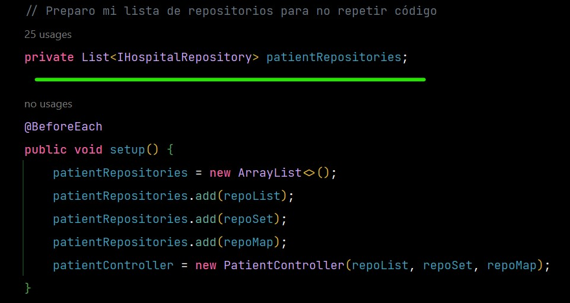
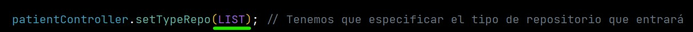
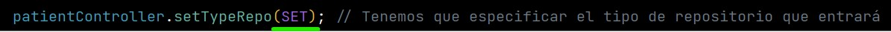
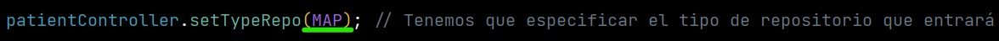
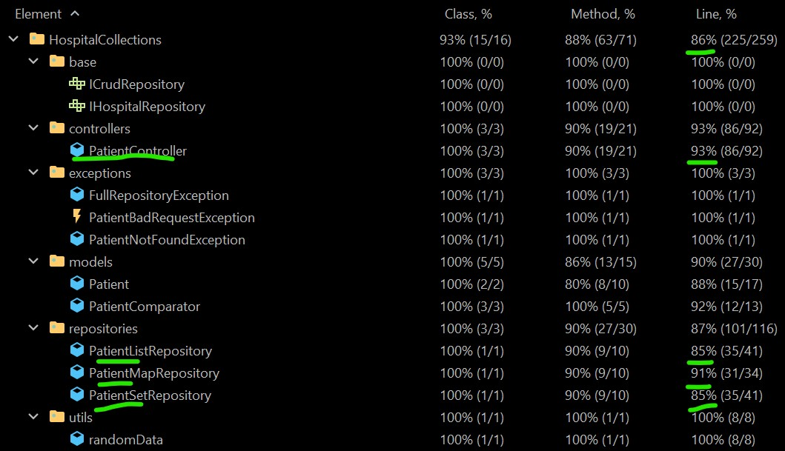

# Datos alumno

- Nombre: Angel Maroto Chivite
- Email Luis Vives: angel.maroto@alumno.iesluisvives.org
- GitHub Username: Sbytmacke

&nbsp;

## 1. Diseño implementado

He empleado JAVA y Maven con las dependencias de JUNIT y Mockito.

Hay tres repositorios donde:

- El primero se ha realizado con listas
- El segundo con conjuntos (TreeSet)
- El tercero con mapas (TreeMap)

He utilizado una clase abstracta en los repositoryTest para no repetir código, ya que los tres respositorios implementan
las mismas funciones devolviendo los mismos tipos de valores

Los repositorios se inyectan en el controlador que es el que va a saltar las
excepciones y filtrar.

Deberemos mediante la función "controller.setTypeRepo(Type.Repo)" elegir el tipo de
repositorio, que manipular.

---

## 3. Covertura Final

86% de todo el código está probado

